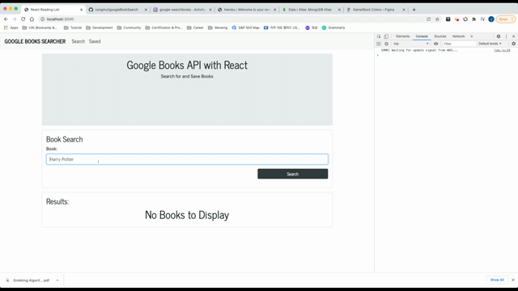

# Google Books Search App
 

## Table of Contents
1. [Description](#Description)
2. [Usage](#Usage)
3. [Installation](#Installation)
4. [Test](#Test)
5. [Contributoring](#Contributoring)

## Description
This app is for searching books which a user is interested in from Google API

## Usage
npm i to set environment  

Deploy: https://google-searchbooks.herokuapp.com/  

## Installation 
To install necessary dependencies, run the following command:
node server.js

## Frontend
* React.js
* React-dom
* Axios
* BootStrap
* React-BootStarp
* BootStrap-icons

## Backend
None

## Contributoring
Contact me by email : congmul@hotmail.com  
Contact me by gitHub : <a href="https://github.com/congmul">congmul</a>
# searchingCompanyPractice
# searchSymbolCompany
